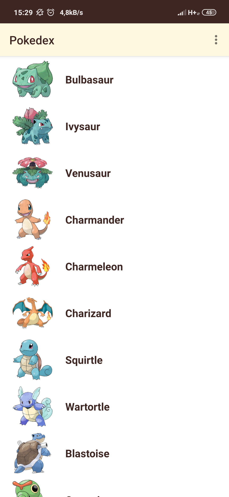
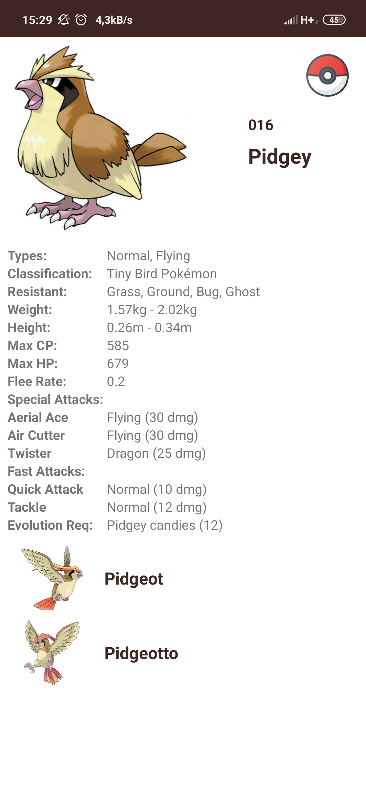
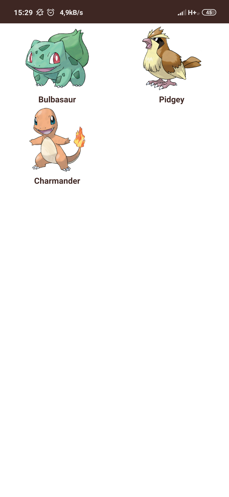

# Pokedex

Simple Android (Kotlin) application consuming GraphQL API with SQLite (Anko) usage.

## Getting Started

The application requires a running server with GraphQL API.  
The server is available [here.](https://github.com/Michuu93/graphql-pokemon)

After starting the server, you need to configure the API_URL appropriately in the class:
`pokedex/app/src/main/java/com/michuu93/pokedex/PokemonApiClient.kt`

## Screenshots

